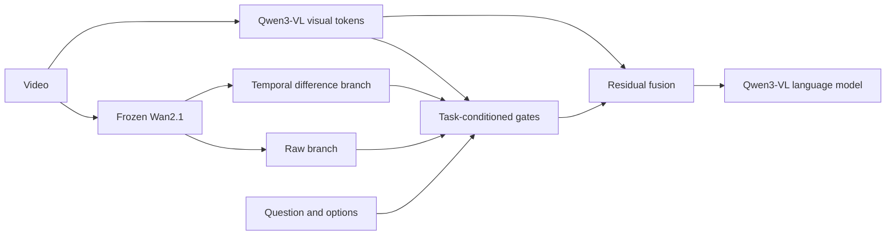

# GenDSR: Transferring Representations from Video Generation Models for Dynamic Spatial Reasoning

**Ke Yang · Zhenyu Zhang · Jun Li** · Nanjing University

GenDSR is the code release for our 2026 preprint. It transfers intermediate
features from a frozen video generation model into a video-language model to
improve reasoning about changing spatial relationships. This repository contains
data preparation, feature extraction, training, and DSR-Bench evaluation code.

## Overview

Vision-language models can recognize objects in a video yet struggle to track
how their spatial relationships change. GenDSR uses Wan2.1's generative
representation as an additional source of spatial and temporal evidence for
Qwen3-VL. It exposes two views of the same Wan feature grid: **raw features**
retain scene context, while **first temporal differences** emphasize change.
Both are aligned to Qwen visual tokens, projected independently, and combined
by tokenwise gates conditioned on the question and visual content.



Wan features are extracted with one denoiser pass under an empty-prompt
condition at timestep 300, using zero-indexed DiT block 20. Temporal
differences are computed on the native Wan grid before temporal interpolation
and spatial pooling. The fused residual is added after Qwen's visual merger;
Wan and Qwen's native visual encoder remain frozen.

## Paper results

Overall accuracy on **DSR-Bench**, as reported in the manuscript for the
Qwen3-VL-8B backbone:

| Model | Accuracy |
| --- | ---: |
| Qwen3-VL-8B + SFT | 62.0% |
| GenDSR | **67.2%** |

These are paper-reported results, not measurements from this code release. The
original checkpoint and exact training manifest are unavailable. New runs using
the public annotations may have a different sample set when videos are missing.

## Reproduction

See the [reproduction guide](docs/reproduction.md) for copyable commands,
environment setup, expected outputs, and validation checks. The workflow has
four entry points:

| Stage | Command | Purpose |
| --- | --- | --- |
| Prepare | `gendsr-prepare` | Match DSR Suite annotations to local videos and record missing media |
| Extract | `gendsr-extract` | Cache Wan2.1 features for each unique video |
| Train | `gendsr-train` | Fine-tune Qwen3-VL-8B with raw and temporal-difference fusion |
| Evaluate | `gendsr-eval` | Measure DSR-Bench sample-level accuracy |

Extraction and SFT require separate Python 3.11 environments. The paper used
eight A100 GPUs. Model weights, videos, and cached features are not included;
obtain the [DSR Suite annotations and media](https://huggingface.co/datasets/TencentARC/DSR_Suite-Data),
[Qwen3-VL-8B-Instruct](https://huggingface.co/Qwen/Qwen3-VL-8B-Instruct), and
[Wan2.1-T2V-1.3B](https://huggingface.co/Wan-AI/Wan2.1-T2V-1.3B) separately.

The main implementation is in [`src/gendsr/fusion.py`](src/gendsr/fusion.py),
with model integration in [`qwen.py`](src/gendsr/qwen.py) and Wan extraction in
[`wan_extractor.py`](src/gendsr/wan_extractor.py). The fixed method and training
recipe are in [`configs/gendsr.yaml`](configs/gendsr.yaml).

## Citation

If you use this work, please cite the preprint:

```bibtex
@misc{yang2026gendsr,
  title  = {GenDSR: Transferring Representations from Video Generation Models for Dynamic Spatial Reasoning},
  author = {Yang, Ke and Zhang, Zhenyu and Li, Jun},
  year   = {2026},
  note   = {Preprint}
}
```

## Acknowledgements

We thank the authors of [DSR Suite](https://github.com/TencentARC/DSR_Suite)
for releasing DSR-Train and DSR-Bench, and the authors of
[GeoSR](https://github.com/SuhZhang/GeoSR) and
[4DThinker](https://github.com/zhangquanchen/4DThinker) for their open work on
dynamic spatial reasoning. We also thank the
[Qwen3-VL](https://github.com/QwenLM/Qwen3-VL) and
[Wan2.1](https://github.com/Wan-Video/Wan2.1) teams for releasing the models
and code used by this project.

## License

This repository is released under [Apache-2.0](LICENSE).
