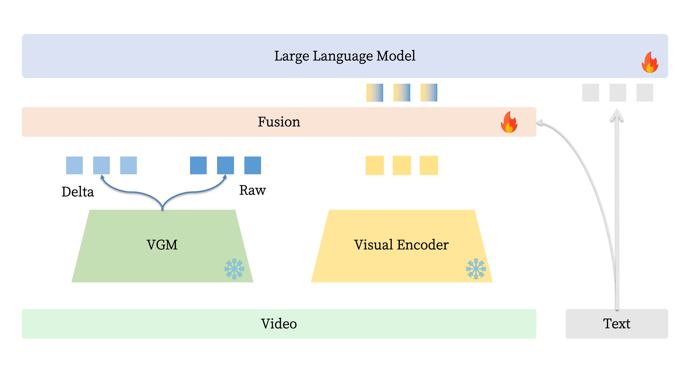
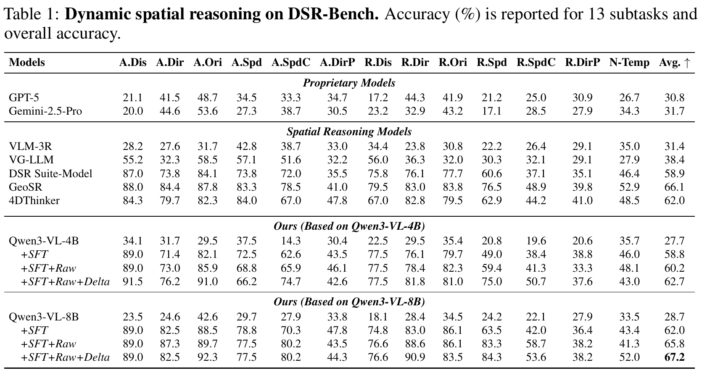

# GenDSR: Transferring Representations from Video Generation Models for Dynamic Spatial Reasoning

[Paper (PDF)](paper.pdf)

## Abstract

Dynamic spatial reasoning is essential for connecting visual intelligence to
the physical world, yet remains challenging for vision-language models (VLMs),
which must preserve scene state while tracking how spatial relations evolve
over time. Meanwhile, video generation models (VGMs), trained to synthesize
temporally coherent world dynamics, offer a rich source of spatiotemporal
representations. We present ***GenDSR***, a framework that transfers
intermediate representations from VGM into VLM for dynamic spatial reasoning.
Rather than treating a VGM feature as a monolithic prior, *GenDSR* constructs
two complementary branches: a raw branch preserving holistic generative
context and a delta branch emphasizing temporal variation. Task-conditioned
tokenwise gates then fuse both signals and inject the result into the native
visual representation. On DSR-Bench, *GenDSR* achieves **67.2%**, surpassing
the previous best result and establishing a new state of the art.



The snowflake and flame icons mark frozen and trainable modules, respectively.

## Paper results

The paper reports accuracy on 13 **DSR-Bench** subtasks and overall accuracy.
With the Qwen3-VL-8B backbone, GenDSR reaches **67.2%** overall.

<a href="assets/dsr_bench_table.png"></a>

## Reproduction

See the [reproduction guide](docs/reproduction.md) for copyable commands,
environment setup, expected outputs, and validation checks. The workflow has
four entry points:

| Stage | Command | Purpose |
| --- | --- | --- |
| Prepare | `gendsr-prepare` | Match DSR Suite annotations to local videos and record missing media |
| Extract | `gendsr-extract` | Cache Wan2.1 features for each unique video |
| Train | `gendsr-train` | Fine-tune Qwen3-VL-8B with raw and temporal-difference fusion |
| Evaluate | `gendsr-eval` | Measure DSR-Bench sample-level accuracy |

Model weights, videos, and cached features are not included;
obtain the [DSR Suite annotations and media](https://huggingface.co/datasets/TencentARC/DSR_Suite-Data),
[Qwen3-VL-8B-Instruct](https://huggingface.co/Qwen/Qwen3-VL-8B-Instruct), and
[Wan2.1-T2V-1.3B](https://huggingface.co/Wan-AI/Wan2.1-T2V-1.3B) separately.

## Citation

If you use this work, please cite the preprint:

```bibtex
@misc{yang2026gendsr,
  title  = {GenDSR: Transferring Representations from Video Generation Models for Dynamic Spatial Reasoning},
  author = {Ke Yang and Zhenyu Zhang and Jun Li},
  year   = {2026},
  note   = {Preprint}
}
```

## Acknowledgements

We thank the authors of [DSR Suite](https://github.com/TencentARC/DSR_Suite)
for releasing DSR-Train and DSR-Bench, and the authors of
[GeoSR](https://github.com/SuhZhang/GeoSR) and
[4DThinker](https://github.com/zhangquanchen/4DThinker) for their open work on
dynamic spatial reasoning. We also thank the
[Qwen3-VL](https://github.com/QwenLM/Qwen3-VL) and
[Wan2.1](https://github.com/Wan-Video/Wan2.1) teams for releasing the models
and code used by this project.

## License

This repository is released under [Apache-2.0](LICENSE).
